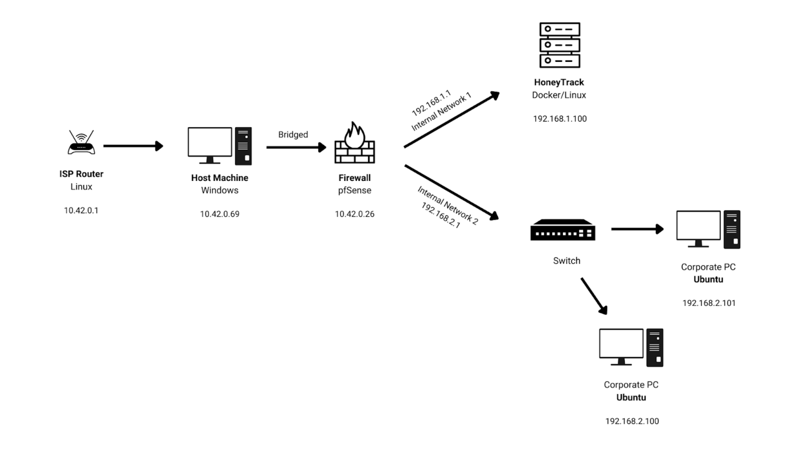

# HoneyTrack

## Introduction

With the tremendous growth of cyber-attacks, the loss of private or sensitive data has risen to a peak. Honeypots are one of the most concerned topics in the field of cyber security currently.

 
 &nbsp;

HoneyTrack is a honeypot cum SIEM tool that uses various technologies like Docker, Shell Scripts, Python, Elastic Search, Kibana, and Filebeats which protect an organization's database as well it backtracks the hacker when it intrudes the target network.

Information about the attacker will be gathered by the bot in the honeypot which will help us reach the roots of the attacker. The target networks could be varied and cause a lot of damage when sensitive data will be lost/stolen.

However, this honeypot is like a traditional honeypot but quite updated with new-generation technology and their needs related to cyber-security.

## Methodology

The first step and concern behind developing this project were to ensure data privacy and safety by every means for every organization. Everything was built from scratch to come up with a safe and extremely secure tool. To initiate the process an environment was created in which a honeypot could be set up.

To accomplish this stage, Docker, an open-source software, helped us create a base of the LINUX system where we could build the entire honeypot. When the intruder first tries to intrude into the system uses a brute force attack. However, there is a very rare possibility of it cracking into the system.

Later, python codes were developed to build the honeypot and set all its functionalities. In the worst-case scenario, where the cracker succeeds in intruding into our honeypot then payloads (viruses).

 

 Fig. Local Network Architecture (On ORACLE Virtual Box) 
 &nbsp;

 

 Fig. Data Flow Diagram 
 &nbsp;

 

 Fig. Use Case Diagram 
 &nbsp;

### Install

1. Install Docker for your operating system (Linux is preferred)

    Documentation to install docker can be found on [https://docs.docker.com/engine/install/](https://docs.docker.com/engine/install/)

2. Clone the repository

    ~~~~~~~~~~~~~~~~~~~~~~~~~~~~~~~~~~~~~~~~~~~~~~~~~~~~~~~~
    git clone git@github.com:aatharvauti/HoneyTrack-SSH.git
    ~~~~~~~~~~~~~~~~~~~~~~~~~~~~~~~~~~~~~~~~~~~~~~~~~~~~~~~~

3. Build the Docker Container
    ~~~~~~~~~~~~~~~~~~~~~~~~~~~~~~~~~~~~~~~~~~~~~~~~~~~~~~~~
    sudo docker build -t local/honeytrack-ssh-vf-cloud:latest -f docker/Dockerfile .
    ~~~~~~~~~~~~~~~~~~~~~~~~~~~~~~~~~~~~~~~~~~~~~~~~~~~~~~~~

    ~~~~~~~~~~~~~~~~~~~~~~~~~~~~~~~~~~~~~~~~~~~~~~~~~~~~~~~~
    -t <user/name:version>      tag of the built image
    -f <Dockerfile>             Location of the Dockerfile
    ~~~~~~~~~~~~~~~~~~~~~~~~~~~~~~~~~~~~~~~~~~~~~~~~~~~~~~~~

4. Run the Docker Image

    ~~~~~~~~~~~~~~~~~~~~~~~~~~~~~~~~~~~~~~~~~~~~~~~~~~~~~~~~
    sudo docker container run --restart=always -it --hostname ssh-server\
    -p 22:22 local/honeytrack-ssh-vf-cloud:latest /bin/bash
    ~~~~~~~~~~~~~~~~~~~~~~~~~~~~~~~~~~~~~~~~~~~~~~~~~~~~~~~~

    ~~~~~~~~~~~~~~~~~~~~~~~~~~~~~~~~~~~~~~~~~~~~~~~~~~~~~~~~
    --restart=always        Container restarts instead of exiting
    -it                     Interactive Mode for shell access
    --hostname <name>       Public Hostname for the container
    -p <port:port>          Binding of exposed ports between HOST:DOCKER
    <name of the image>     The -t <name> from the previous command
    <command>               Command to run when the container starts
    ~~~~~~~~~~~~~~~~~~~~~~~~~~~~~~~~~~~~~~~~~~~~~~~~~~~~~~~~

5. Docker Internal Configuration

    Run the start.sh shell script to configure the parameters of Honeypot
    ~~~~~~~~~~~~~~~~~~~~~~~~~~~~~~~~~~~~~~~~~~~~~~~~~~~~~~~~
    # ./start.sh
    ~~~~~~~~~~~~~~~~~~~~~~~~~~~~~~~~~~~~~~~~~~~~~~~~~~~~~~~~

1. Running the Docker Container

&nbsp;

2. Running the script start.sh

&nbsp;

3. Setting the ROOT Password

&nbsp;

4. Settings CRON jobs frequency

&nbsp;

5. Configuring SSH - Enter username and password of the remote host

&nbsp;

6. Configuring Email Transfer of Logs

&nbsp;

Now Honeypot is setup and logs are being collected
- `/var/log/auth.log`
- `/var/log/dnsrout/`

&nbsp;
&nbsp;

### Achivements and Credits

To test Honeytrack, we set it up live on Azure Cloud and monitored attacks for 30 days which generated 1,000,000+ logs. This provided a great insight on both - the tool as well as the emerging Cyberattacks throughout the world.

After the successful tests, we collaborated with Cyberpeace Foundation through Department of Cybersecurity at Shah and Anchor Kutchhi Engineering College.

Made as a part of 2nd Year and 3rd Year Academic Project by: Atharva Auti, Jay Makwana, Shrawani Pagar, and Vivek Mishra at

Guides: Ms. Shwetambari Borade and Dr. Nilakshi Jain
