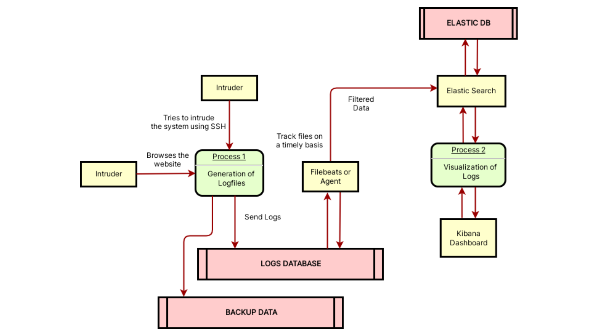

   
    
  <h3><i>Honeypot with a twist of Red Teaming</i></h3>

---

With the tremendous growth of cyber-attacks, the loss of private or sensitive data has risen to a peak ☠️. Honeypots are one of the most concerned topics in the field of cyber security currently.

HoneyTrack is a honeypot 🍯 cum SIEM tool 📊 that uses various technologies like Docker 🐋, Shell 🐚 Scripts, Python 🐍, Elastic Search 🔍, Kibana 📈, and Filebeats 📂 which protect an organization's database as well it backtracks the hacker when it intrudes the target network. &nbsp;

 
 &nbsp;

Information about the attacker will be gathered by the bot in the honeypot which will help us reach the roots of the attacker 💀. The target networks could be varied and cause a lot of damage when sensitive data will be lost/stolen.

However, this honeypot is like a traditional honeypot but quite updated with new-generation technology 🚀 and their needs related to cyber-security. &nbsp;

 
 &nbsp;

## Methodology

The first step and concern behind developing this project were to ensure data privacy and safety by every means for every organization. Everything was built from scratch to come up with a safe and extremely secure tool. To initiate the process an environment was created in which a honeypot could be set up.

To accomplish this stage, Docker 🐋, an open-source software, helped us create a base of the LINUX 🐧 system where we could build the entire honeypot. When the intruder 👺 first tries to intrude into the system uses a brute force attack. However, there is a very rare possibility of it cracking into the system.

Later, python 🐍 codes were developed to build the honeypot and set all its functionalities. In the worst-case scenario, where the cracker succeeds in intruding into our honeypot he will be affected by payloads (viruses) ☠️.

Check out other repositories at [github/HoneyTrack](https://github.com/HoneyTrack)

 

 Fig. Local Network Architecture (On ORACLE Virtual Box) 

The figure above represents a testing diagram used to demonstrate HoneyTrack on Local Networks in Oracle VirtualBox.

Any request outside of the network must pass through the firewall. There are certain parameters used to determine a malicious attacker such that he will be redirected to Honeypot in a separate VLAN.

&nbsp;

 

 Fig. Data Flow Diagram 

The figure above represents the data flow or application flow diagram of HoneyTrack.

The logs generated are stored in the logs database with a backup set as a cronjob on a regular basis. The data will be collected by the Elastic Agent or Filebeats, that would be passed on to Elastic Search's Discovery and then a Dashboard is created using Kibana.

## Installation

1. Install Docker for your host operating system (Linux is preferred)

    Documentation to install docker can be found on [https://docs.docker.com/engine/install/](https://docs.docker.com/engine/install/)

2. Clone the repository

    ~~~~~~~~~~~~~~~~~~~~~~~~~~~~~~~~~~~~~~~~~~~~~~~~~~~~~~~~
    git clone git@github.com:aatharvauti/HoneyTrack-SSH.git
    ~~~~~~~~~~~~~~~~~~~~~~~~~~~~~~~~~~~~~~~~~~~~~~~~~~~~~~~~

3. Build the Guest Docker Container
    ~~~~~~~~~~~~~~~~~~~~~~~~~~~~~~~~~~~~~~~~~~~~~~~~~~~~~~~~
    sudo docker build -t local/honeytrack-ssh-vf-cloud:latest -f docker/Dockerfile .
    ~~~~~~~~~~~~~~~~~~~~~~~~~~~~~~~~~~~~~~~~~~~~~~~~~~~~~~~~

    ~~~~~~~~~~~~~~~~~~~~~~~~~~~~~~~~~~~~~~~~~~~~~~~~~~~~~~~~
    -t <user/name:version>      tag of the built image
    -f <Dockerfile>             Location of the Dockerfile
    ~~~~~~~~~~~~~~~~~~~~~~~~~~~~~~~~~~~~~~~~~~~~~~~~~~~~~~~~

4. Run the Guest Docker Image

    ~~~~~~~~~~~~~~~~~~~~~~~~~~~~~~~~~~~~~~~~~~~~~~~~~~~~~~~~
    sudo docker container run --restart=always -it --hostname ssh-server\
    -p 22:22 local/honeytrack-ssh-vf-cloud:latest /bin/bash
    ~~~~~~~~~~~~~~~~~~~~~~~~~~~~~~~~~~~~~~~~~~~~~~~~~~~~~~~~

    ~~~~~~~~~~~~~~~~~~~~~~~~~~~~~~~~~~~~~~~~~~~~~~~~~~~~~~~~
    --restart=always        Container restarts instead of exiting
    -it                     Interactive Mode for shell access
    --hostname <name>       Public Hostname for the container
    -p <port:port>          Binding of exposed ports between HOST:DOCKER
    <name of the image>     The -t <name> from the previous command
    <command>               Command to run when the container starts
    ~~~~~~~~~~~~~~~~~~~~~~~~~~~~~~~~~~~~~~~~~~~~~~~~~~~~~~~~

&nbsp;

 

5. Docker Internal Configuration

    Run the start.sh shell script to configure the parameters of Honeypot
    ~~~~~~~~~~~~~~~~~~~~~~~~~~~~~~~~~~~~~~~~~~~~~~~~~~~~~~~~
    # ./start.sh
    ~~~~~~~~~~~~~~~~~~~~~~~~~~~~~~~~~~~~~~~~~~~~~~~~~~~~~~~~

6. Set a new ROOT password for the Honeypot

    ~~~~~~~~~~~~~~~~~~~~~~~~~~~~~~~~~~~~~~~~~~~~~~~~~~~~~~~~
    Set a password for the root user:

    New password:
    Retype new password:
    passwd: password updated successfully
    ~~~~~~~~~~~~~~~~~~~~~~~~~~~~~~~~~~~~~~~~~~~~~~~~~~~~~~~~

7. Set the frequency of CRON jobs

    ~~~~~~~~~~~~~~~~~~~~~~~~~~~~~~~~~~~~~~~~~~~~~~~~~~~~~~~~
    Select an Option:
    1] Every minute (Live - recommended if using SSH transfer)
    2] Hourly (24 times a day)
    3] Every 8 hours (3 times a day)
    4] Daily (once a day)
    ~~~~~~~~~~~~~~~~~~~~~~~~~~~~~~~~~~~~~~~~~~~~~~~~~~~~~~~~

8. Configuring SSH transfer of logs

    Make sure that your host's SSH port is not 22 since it will be allocated for the Honeypot.
    You can change the SSH configuration of the host machine at `/etc/ssh/sshd_config`

    Use the default options and an empty passphrase for generating keys

    ~~~~~~~~~~~~~~~~~~~~~~~~~~~~~~~~~~~~~~~~~~~~~~~~~~~~~~~~
    Do you want to configure SSH transfer? (Y/n): y
    Generating Keys
    Generating public/private rsa key pair.
    Enter file in which to save the key (/root/.ssh/id_rsa):
    Enter passphrase (empty for no passphrase):
    Enter same passphrase again:
    Your identification has been saved in /root/.ssh/id_rsa
    Your public key has been saved in /root/.ssh/id_rsa.pub
    The key fingerprint is:
    SHA256:xxxxxxxxxxxxxxxxxxxxxxxxxxxxxxx root@ssh-server
    The key's randomart image is:
    +---[RSA 3072]----+
    | xxxxxxxx.       |
    | xxxxxxxxx.      |
    |xxxxxxxxxx       |
    |o+o . .+oo       |
    |.oo.  . S        |
    |oo.    .         |
    |.E.. o           |
    |. ooX            |
    |  o*.+.          |
    +----[SHA256]-----+
    Keys generated Successfully

    ~~~~~~~~~~~~~~~~~~~~~~~~~~~~~~~~~~~~~~~~~~~~~~~~~~~~~~~~

9. Configure the transfer by entering Host Machine's details
    You might need a public IP with virtual servers (static) or ddns enabled (dynamic) to use your host machine's IP address to connect SSH if you're transfering from a remote machine. You can also use VPN services like [LOGMEIN](https://vpn.net/linux), [ZEROTIERONE](https://www.zerotier.com/) or [MESHNET by NordVPN](https://nordvpn.com/meshnet/) or set up [Cloudflare Tunneling](https://www.cloudflare.com/en-gb/products/tunnel/) in your machine.

    ~~~~~~~~~~~~~~~~~~~~~~~~~~~~~~~~~~~~~~~~~~~~~~~~~~~~~~~~
    Enter the username of the remote SSH machine
    auti

    Enter the IP Address of the remote SSH machine
    192.168.0.108

    Enter the SSH port of the remote SSH machine
    1234

    Enter the remote path to store logs
    /home/auti/HoneyTrack-Logs
    Uploading Key to Remote Server....
    /usr/bin/ssh-copy-id: INFO: Source of key(s) to be installed: "/root/.ssh/id_rsa.pub"

    The authenticity of host '[192.168.0.108]:1234 ([192.168.0.108]:1234)' can't be established.
    ECDSA key fingerprint is SHA256:xxxxxxxxxxxxxxxxxxxxxxxxxxxxxxx.
    Are you sure you want to continue connecting (yes/no/[fingerprint])? yes

    /usr/bin/ssh-copy-id: INFO: attempting to log in with the new key(s), to filter out any that are already installed
    /usr/bin/ssh-copy-id: INFO: 1 key(s) remain to be installed -- if you are prompted now it is to install the new keys

    auti@192.168.0.108's password:

    Number of key(s) added: 1

    Now try logging into the machine, with:   "ssh -p '1234' 'auti@192.168.0.108'"
    and check to make sure that only the key(s) you wanted were added.

    SSH has been configured successfully

    ~~~~~~~~~~~~~~~~~~~~~~~~~~~~~~~~~~~~~~~~~~~~~~~~~~~~~~~~

10. Configure Logs using Email Transfer
    Note that this is inefficient way of transfering logs remotely and your email inbox storage can also fill up very soon. This method is generally not recommended over SSH.

    To configure email, you first need to
        - Enable 2FA on your email service account (Google Email is preferred)
        - Create a New App Password (Manage Account > Search for App Password > Create New)
        - Note down the App Password as it won't be visible again

    The password would be hidden and not be `******` as normal behavior in Linux

    ~~~~~~~~~~~~~~~~~~~~~~~~~~~~~~~~~~~~~~~~~~~~~~~~~~~~~~~~

    Do you want to configure email transfer? (Y/n): y
    Enter the Correspondent's EMAIL Address
    example@example.com

    Enter the Password for the given EMAIL Address

    Enter the First Recipient's EMAIL Address
    rec1@example.com

    Enter the Second Recipient's EMAIL Address
    rec2@example.com
    Email has been configured successfully

    ~~~~~~~~~~~~~~~~~~~~~~~~~~~~~~~~~~~~~~~~~~~~~~~~~~~~~~~~

11. HoneyTrack is setup and now you're good to go!

    The logs are being collected and stored at the following locations

    ~~~~~~~~~~~~~~~~~~~~~~~~~~~~~~~~~~~~~~~~~~~~~~~~~~~~~~~~
    - /var/log/auth.log
    - /var/log/dnsrout/
    ~~~~~~~~~~~~~~~~~~~~~~~~~~~~~~~~~~~~~~~~~~~~~~~~~~~~~~~~

&nbsp;
&nbsp;

## Achivements and Credits

To test Honeytrack, we set it up live on Azure Cloud ☁️ and monitored attacks for 30 days which generated 1,000,000+ logs 📊. This provided a great insight on both - the tool as well as the emerging Cyberattacks throughout the world 🌎.

After the successful tests, we collaborated 🤝🏻 with Cyberpeace Foundation through Department of Cybersecurity at Shah and Anchor Kutchhi Engineering College.

This project was exhibited for the first CiiA Exhibition at Worli, Mumbai where Innovative projects were presented. The project also won 2nd 🥈 Prize at "Technovation" - National Paper Presentation Competition.

An [IEEE Paper](https://ieeexplore.ieee.org/document/10063105) Presentation and Publication at SCEECS 2023, MANIT, Bhopal and a Journal Publication by [JEITR](https://www.jetir.org/papers/JETIR2305F76.pdf) are published.

&nbsp;

Made as a part of 2nd Year and 3rd Year (2021-2023) Engineering Academic Project by: @aatharvauti [hi@auti.dev], @hackvm, @thejaymakwana, and @shrawinnie
